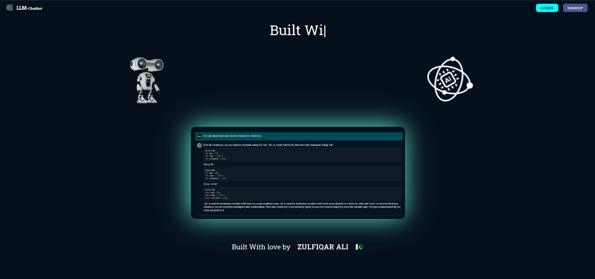

# LLM-SaaS

LLM-SaaS (Large Language Modeling - Software as a Service) is an innovative platform harnessing the power of Large Language Models, driven by OpenAI's API, to provide a cutting-edge language modeling and learning experience.

## Features
<li><b>Advanced Language Modeling:</b></li>Utilizing the capabilities of Large Language Models to offer state-of-the-art language understanding and generation.

<li><b>Secure Authentication and Authorization:</b></li>Complete authentication features built with React and Vite, ensuring robust security for user sign-in and login functionalities.
<li><b>Immersive Language Learning: </b></li>Enhancing language learning experiences through interactive interfaces powered by React and Vite.

## Technologies Used

<li><b>Front-End:  </b></li>React, Vite, Material View etc
<li><b>Language Modeling: </b></li> OpenAI's API for Large Language Models
<li><b>Authentication:</b></li> Customized authentication and authorization mechanisms
<li><b>User Experience: </b></li> Intuitive interfaces for seamless learning interactions

## About
LLM-SaaS revolutionizes language modeling and learning through cutting-edge technologies. This repository contains the front-end implementation, focusing on providing a seamless and secure user experience with advanced language modeling features.

## Instructions:
- Clone the Repository:
- Clone the LLM-SaaS repository to your local machine if you haven't already.

<code>git clone https://github.com/your-username/LLM-SaaS.git
</code>
- ### Navigate to the Project Directory:
- Open a terminal or command prompt and navigate to the cloned repository directory:
  
-  <code> cd LLM-SaaS</code>

  - ### Install Dependencies:
- Run npm install to install all the necessary dependencies for the project.
  
-  <code> npm install</code>

   - ### Run the Development Server:
- Once the dependencies are installed, start the development server to run the project locally:
  
-  <code> npm run dev</code>

 - ### Access the Application:
-  Open a web browser and navigate to the provided local URL (e.g., http://localhost:5173/) to view and interact with your LLM-SaaS application running in the development environment.
  
-  <code> npm run dev</code>

